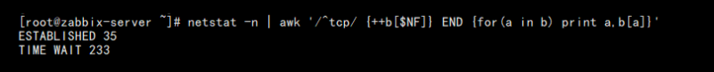

# Linux 运维工程师经典面试题合集

1. 如何查看 HTTP 的并发请求数与其 TCP 连接状态？
   
```shell
etstat -n | awk '/^tcp/ {++b[$NF]} END {for(a in b) print a,b[a]}'
```



Linux 服务器打开文件数也是影响并发的重要一环，具体可以查看该文件配置：/etc/security/limits.conf

当然同级目录下面的 limits.d 目录下的的配置文件也需要关注，也可以使用 ulimit -n 查看当前的配置数量。


2. 查看每个 IP 地址的连接数

```shell
netstat -n | awk '/^tcp/ {print $5}' | awk -F: '{print $1}' | sort | uniq -c | sort -rn
```

